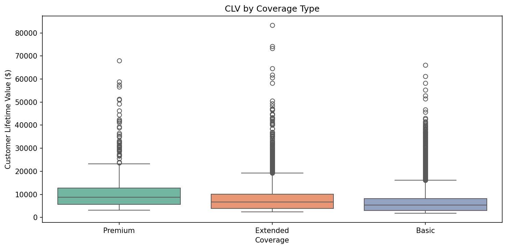
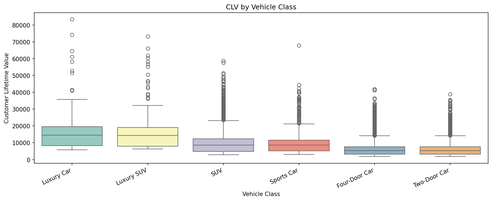
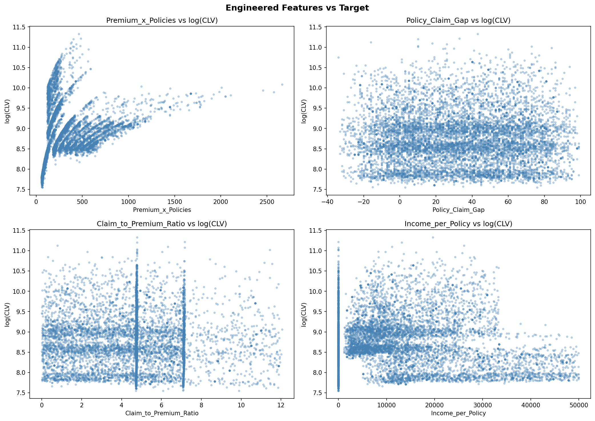
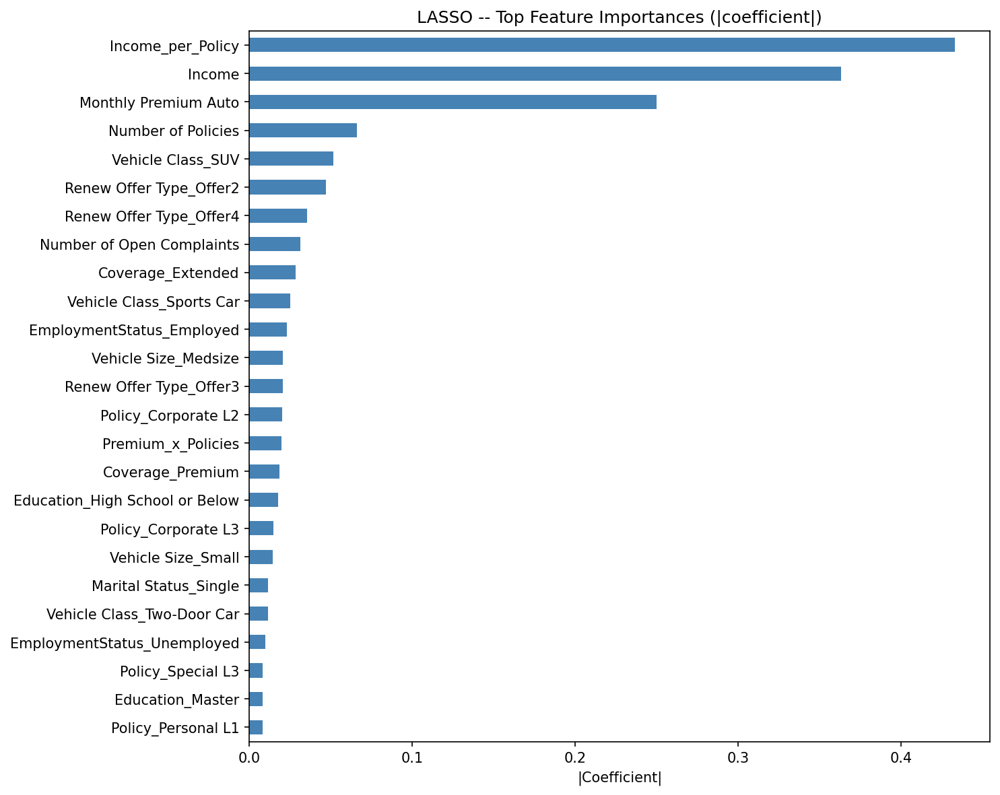
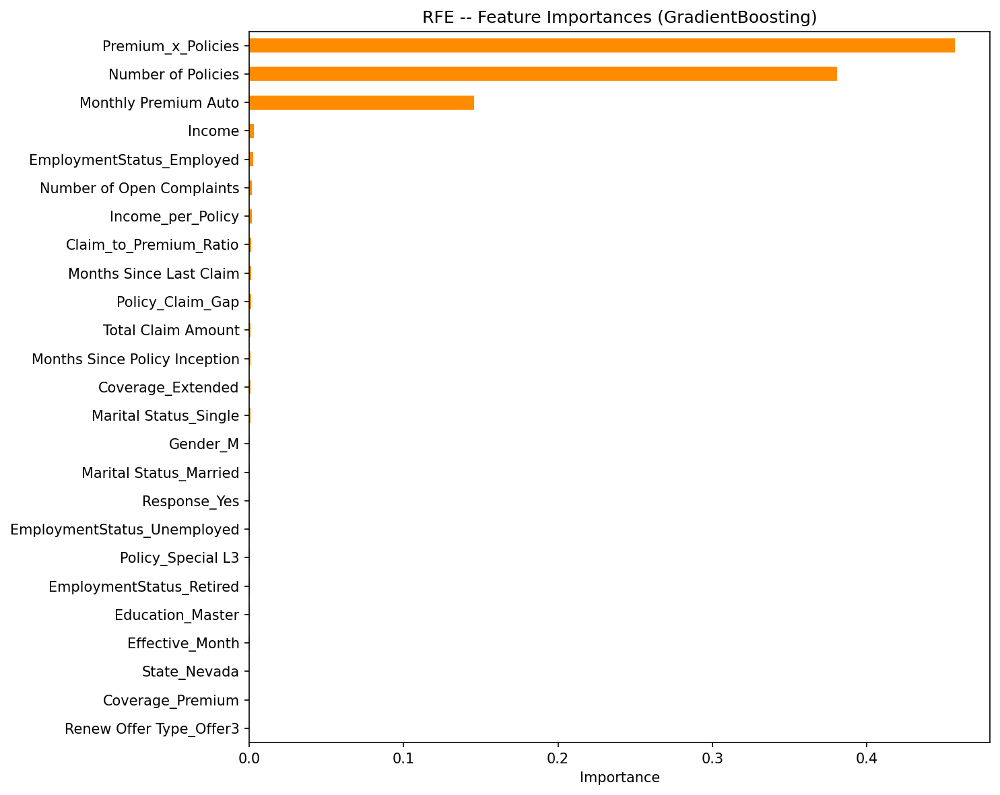
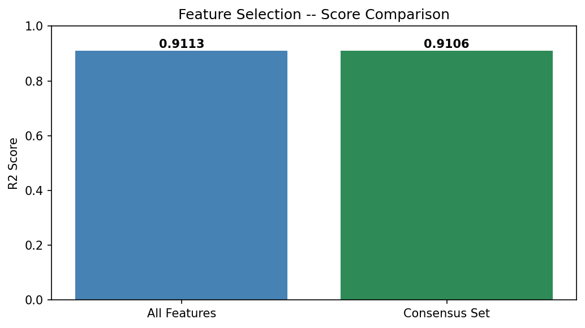
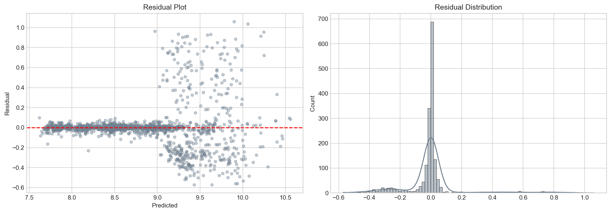
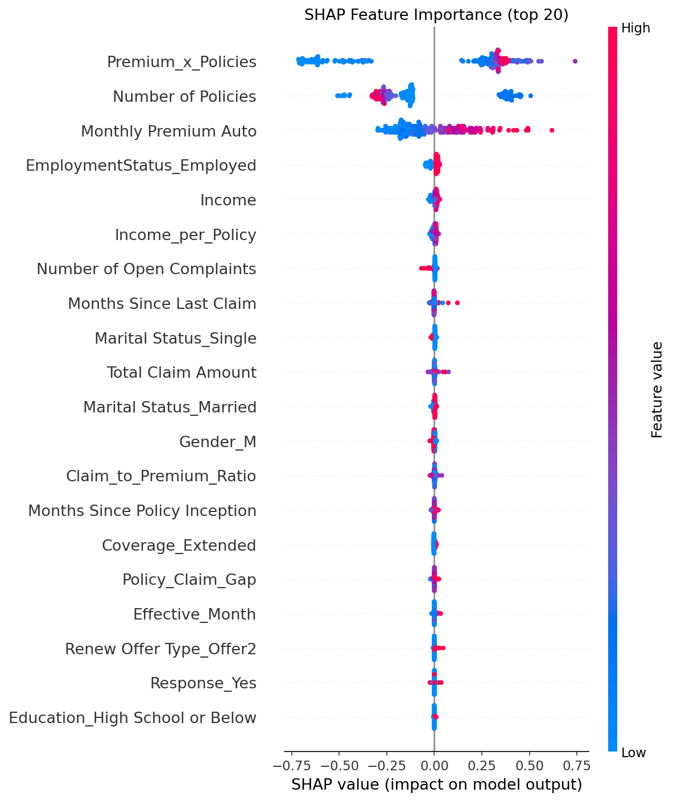

# Customer Lifetime Value Prediction for Auto Insurance Company


**Predict customer lifetime value for auto insurance customers using regression models — enabling targeted retention and premium optimization strategies.**

---

## Table of Contents
1. [Problem Statement](#problem-statement)
2. [Dataset](#dataset)
3. [Project Structure](#project-structure)
4. [Workflow](#workflow)
5. [EDA Highlights](#eda-highlights)
6. [Feature Engineering](#feature-engineering)
7. [Feature Selection](#feature-selection)
8. [Model Results](#model-results)
9. [Business Insights](#business-insights)
10. [Setup & Usage](#setup--usage)
11. [Tech Stack](#tech-stack)

---

## Problem Statement

Customer Lifetime Value (CLV) quantifies the total revenue a business can expect from a single customer account. For auto insurance companies, accurately predicting CLV enables:
- **Targeted retention** campaigns for high-value customers
- **Optimized premium pricing** per risk segment
- **Efficient marketing budget** allocation

This project builds a regression model that predicts CLV from demographic, policy, and claims data, achieving **R2 = 0.9115** with an interpretable Random Forest model.

---

## Dataset

Source: [Vehicle Insurance Customer Data — Kaggle](https://www.kaggle.com/datasets/ranja7/vehicle-insurance-customer-data)

| Feature | Type | Description |
|---|---|---|
| Customer | ID | Unique identifier (dropped before modeling) |
| State | Categorical | Customer's state |
| **Customer Lifetime Value** | **Numerical** | **Target — CLV in dollars ($1,898 – $83,325)** |
| Response | Categorical | Response to last marketing campaign |
| Coverage | Categorical | Basic / Extended / Premium |
| Education | Categorical | Education level |
| Effective To Date | Date | Policy effective date (month extracted) |
| EmploymentStatus | Categorical | Employment status |
| Gender | Categorical | Customer gender |
| Income | Numerical | Annual income |
| Location Code | Categorical | Urban / Suburban / Rural |
| Marital Status | Categorical | Marital status |
| Monthly Premium Auto | Numerical | Monthly auto premium ($) |
| Months Since Last Claim | Numerical | Recency of last claim |
| Months Since Policy Inception | Numerical | Policy age in months |
| Number of Open Complaints | Numerical | Active complaint count |
| Number of Policies | Numerical | Number of active policies |
| Policy Type / Policy | Categorical | Policy type and sub-type |
| Renew Offer Type | Categorical | Type of renewal offer |
| Sales Channel | Categorical | How policy was sold |
| Total Claim Amount | Numerical | Total historical claims |
| Vehicle Class / Size | Categorical | Vehicle classification and size |

**Dataset stats:** 9,134 rows | 24 columns | No missing values | No duplicates

---

## Project Structure

```
Customer-Lifetime-Value-Prediction-For-AutoInsurance-Company/
├── data/
│   ├── raw/               # Original CSV (gitignored)
│   └── processed/         # Cleaned data + feature list (gitignored)
├── notebooks/
│   ├── 01_Data_Preparation.ipynb      # EDA
│   ├── 02_Feature_Engineering.ipynb   # Feature engineering
│   ├── 03_Feature_Selection.ipynb     # LASSO + RFE
│   ├── 04_Model_Training.ipynb        # 11 models
│   └── 05_Model_Evaluation.ipynb      # Tuning + SHAP
├── src/
│   ├── config.py          # All paths, constants, hyperparameters
│   ├── data_loader.py     # Load and validate raw data
│   ├── preprocessing.py   # Clean, encode, engineer features
│   ├── model.py           # Train, evaluate, tune, save models
│   └── visualize.py       # All plot functions -> images/
├── models/                # Saved .pkl model files (gitignored)
├── images/                # All 17 plots -- committed for README display
├── reports/               # Results CSVs + PDF process report
├── scripts/
│   ├── download_data.py   # Kaggle API download
│   ├── build_notebooks.py # Notebook generator
│   └── generate_pdf.py    # PDF process report generator
├── .gitignore
├── requirements.txt
├── README.md
└── main.py                # Full pipeline runner
```

---

## Workflow

```
Raw Data (AutoInsurance.csv, 9134 rows)
   |
   v
01_Data_Preparation.ipynb ---- EDA: distributions, correlations, key findings
   |
   v
02_Feature_Engineering.ipynb -- Imputation, encoding, 4 interaction features
   |
   v
03_Feature_Selection.ipynb ---- LASSO + RFE consensus feature set
   |
   v
04_Model_Training.ipynb ------- 11 models trained, Random Forest wins (R2=0.9106)
   |
   v
05_Model_Evaluation.ipynb ----- GridSearchCV tuning (R2=0.9115), SHAP, residuals
   |
   v
main.py ----------------------- End-to-end pipeline runner
   |
   v
images/ + reports/ (committed) + models/ (gitignored)
```

---

## EDA Highlights

### Target Distribution
CLV is highly right-skewed (skewness = 3.99). Log transformation brings it to near-normal (skewness = 0.05) — essential for all linear models.


### Correlation Heatmap
Monthly Premium Auto shows the strongest positive correlation with CLV. Number of Policies and Total Claim Amount also contribute.


### Numerical Feature Distributions


### CLV by Coverage Type
Extended Coverage customers show ~2x higher median CLV than Basic coverage.



### CLV by Vehicle Class
Luxury Car and Sports Car customers have the highest median CLV.



### Key EDA Findings

| Finding | Detail |
|---|---|
| Dataset size | 9,134 rows, 24 columns |
| Missing values | None |
| CLV range | $1,898 – $83,325 (mean $8,005) |
| CLV skewness (raw) | 3.99 -- heavily right-skewed |
| CLV skewness (log) | 0.05 -- near normal |
| Top numeric predictor | Monthly Premium Auto (highest correlation with CLV) |
| Top categorical predictor | Coverage type (Extended >> Basic) |
| Best vehicle segment | Luxury Car, Sports Car (highest CLV) |

---

## Feature Engineering

| Feature | Formula | Rationale |
|---|---|---|
| CLV_log | log1p(CLV) | Normalize right-skewed target |
| Effective_Month | month(Effective To Date) | Seasonality signal for renewal behavior |
| Premium_x_Policies | Monthly Premium x Num Policies | Total monthly premium commitment |
| Policy_Claim_Gap | Months Inception - Months Since Claim | Loyal customer who hasn't claimed recently |
| Claim_to_Premium_Ratio | Total Claims / (Monthly Premium + 1) | Claims efficiency per premium dollar |
| Income_per_Policy | Income / (Num Policies + 1) | Affordability normalized by portfolio size |



**Outlier decision:** All outliers retained — insurance CLV legitimately contains high-value customers; capping would destroy the signal we are predicting.

---

## Feature Selection

Methods: **LASSO (LassoCV)** + **RFE (GradientBoostingRegressor)** — consensus = union of both.

| Method | Criterion | Features |
|---|---|---|
| LASSO (LassoCV) | Non-zero L1 regularized coefficients | Variable |
| RFE (GradientBoosting) | Recursive elimination, top 30 kept | 30 |
| **Consensus (Union)** | **LASSO ∪ RFE + engineered features** | **Consensus set** |





---

## Model Results

All models trained on log-transformed CLV with 5-fold cross-validation. StandardScaler applied before fitting.

| Model | R2 | RMSE | MAE | CV R2 |
|---|---|---|---|---|
| **Random Forest** | **0.9106** | **0.1989** | **0.0913** | **0.9093** |
| Extra Trees | 0.9067 | 0.2032 | 0.0923 | 0.9079 |
| Gradient Boosting | 0.9033 | 0.2068 | 0.1052 | 0.9017 |
| XGBoost | 0.9006 | 0.2098 | 0.1089 | 0.9001 |
| AdaBoost | 0.8515 | 0.2563 | 0.1857 | 0.8453 |
| Decision Tree | 0.8373 | 0.2683 | 0.1084 | 0.8269 |
| SVR | 0.4662 | 0.4861 | 0.3209 | 0.4325 |
| Linear Regression | 0.3391 | 0.5409 | 0.4122 | 0.3307 |
| Ridge | 0.3391 | 0.5409 | 0.4122 | 0.3307 |
| Lasso | -0.0018 | 0.6659 | 0.5333 | -0.0001 |
| ElasticNet | -0.0018 | 0.6659 | 0.5333 | -0.0001 |

**Tuned Random Forest (GridSearchCV): R2 = 0.9115 | RMSE = 0.1980 | MAE = 0.0913**


### Feature Importance


### Actual vs Predicted


### Residual Analysis


### SHAP Explainability


---

## Business Insights

1. **Monthly Premium Auto** is the single strongest predictor of CLV — customers paying higher premiums generate more lifetime value.
2. **Number of Policies** is the second strongest predictor — multi-policy customers have significantly higher CLV.
3. The engineered **Premium_x_Policies** interaction term ranks in top 5 SHAP importance.
4. **Extended Coverage** customers show ~2x higher median CLV than Basic — coverage type is a strong retention variable.
5. **Luxury Car and Sports Car** vehicle classes correlate with highest CLV — likely due to higher premiums and more policies.
6. **Linear models fail** (R2~0.34) — CLV-feature relationships are highly non-linear; tree-based models are required.

### Recommendations

| Strategy | Action |
|---|---|
| CLV-based retention tiers | Segment High/Medium/Low CLV customers; allocate budgets proportionally |
| Multi-policy upselling | Proactive cross-sell (home+auto bundles) for single-policy customers |
| Coverage upgrade campaigns | Offer Extended Coverage upgrades to Basic customers with high income |
| Luxury vehicle loyalty | Exclusive loyalty programs for Luxury Car / Sports Car segment |
| Claims-based pricing | Use Claim_to_Premium_Ratio in renewal underwriting |
| Seasonal campaign timing | Schedule renewals 30-60 days before peak effective months |

---

## Setup & Usage

```bash
# 1. Clone the repo
git clone https://github.com/bhavesh2418/Customer-Lifetime-Value-Prediction-For-AutoInsurance-Company.git
cd Customer-Lifetime-Value-Prediction-For-AutoInsurance-Company

# 2. Install dependencies
pip install -r requirements.txt

# 3. Set Kaggle credentials (in your .env or environment)
export KAGGLE_USERNAME=your_username
export KAGGLE_KEY=your_key

# 4. Download dataset
python scripts/download_data.py

# 5. Run full pipeline
python main.py

# 6. Launch notebooks
jupyter notebook notebooks/

# 7. Generate PDF report
python scripts/generate_pdf.py
```

---

## Tech Stack

| Tool | Version | Purpose |
|---|---|---|
| Python | 3.9+ | Core language |
| pandas | 2.3.3 | Data manipulation |
| numpy | 2.3.5 | Numerical operations |
| scikit-learn | 1.8.0 | ML models, preprocessing, feature selection |
| XGBoost | 3.2.0 | Gradient boosting |
| SHAP | 0.51.0 | Model explainability |
| matplotlib | 3.10.0 | Visualization |
| seaborn | 0.13.2 | Statistical plots |
| ydata-profiling | 4.18.1 | Automated EDA |
| fpdf2 | 2.8.7 | PDF report generation |
| kaggle | 2.0.0 | Dataset download |
| joblib | 1.5.3 | Model serialization |
| jupyter | 1.1.1 | Notebook environment |
