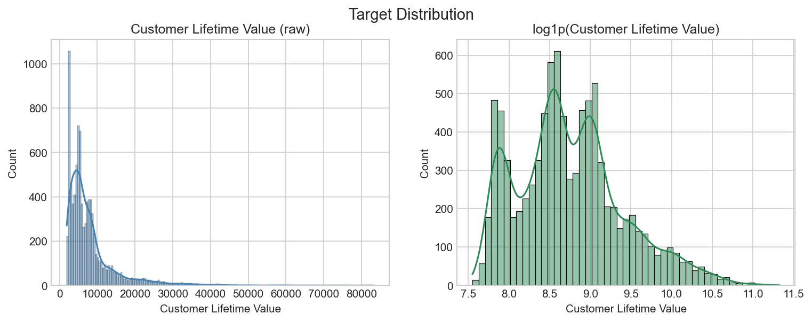
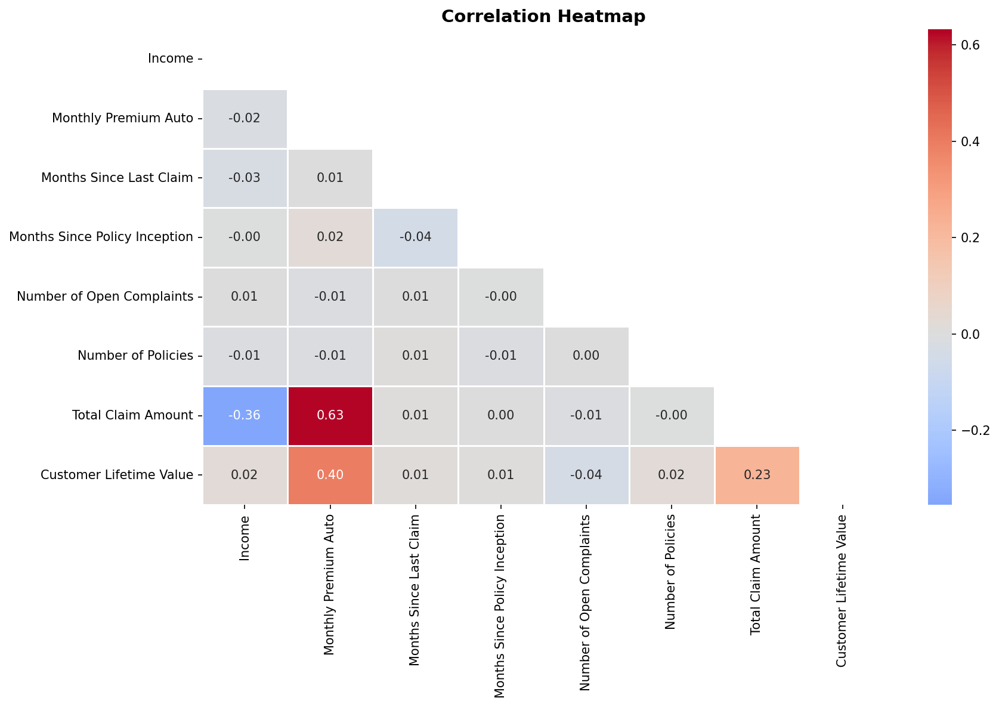
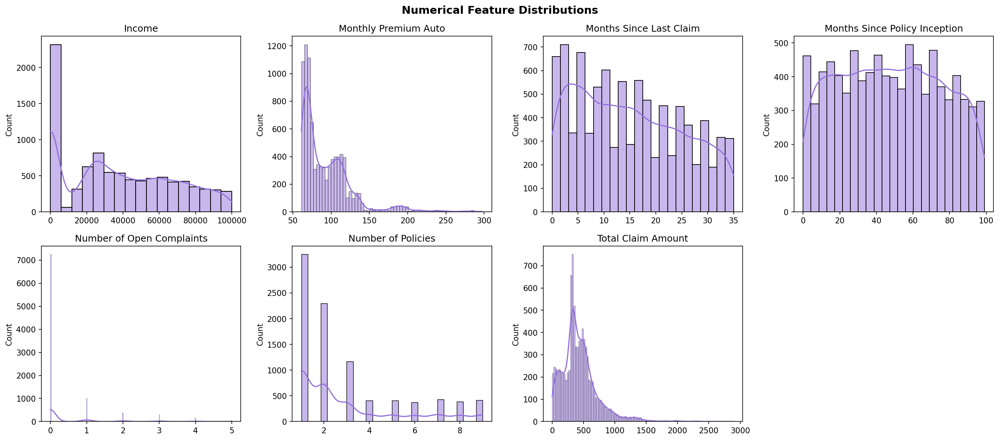
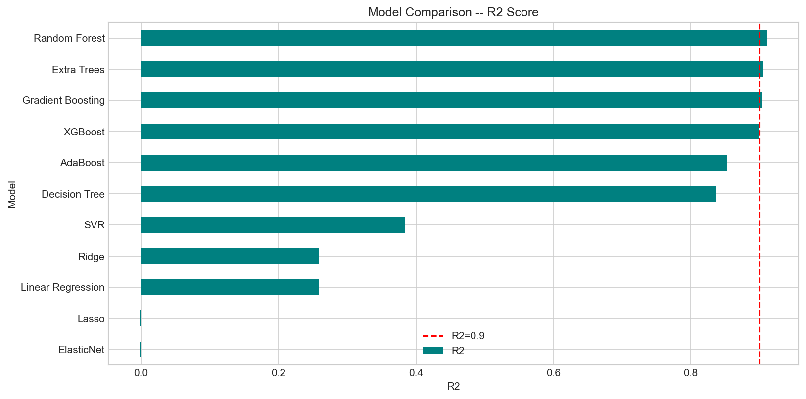
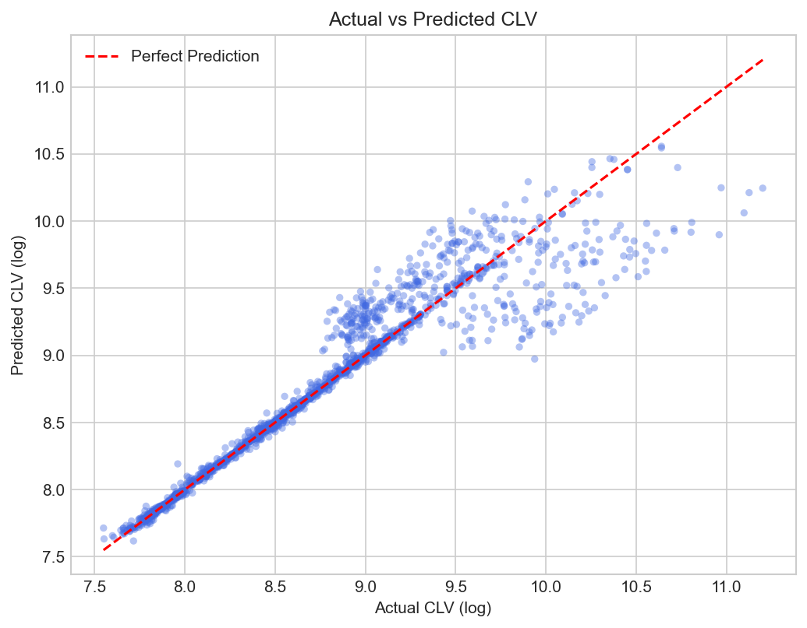
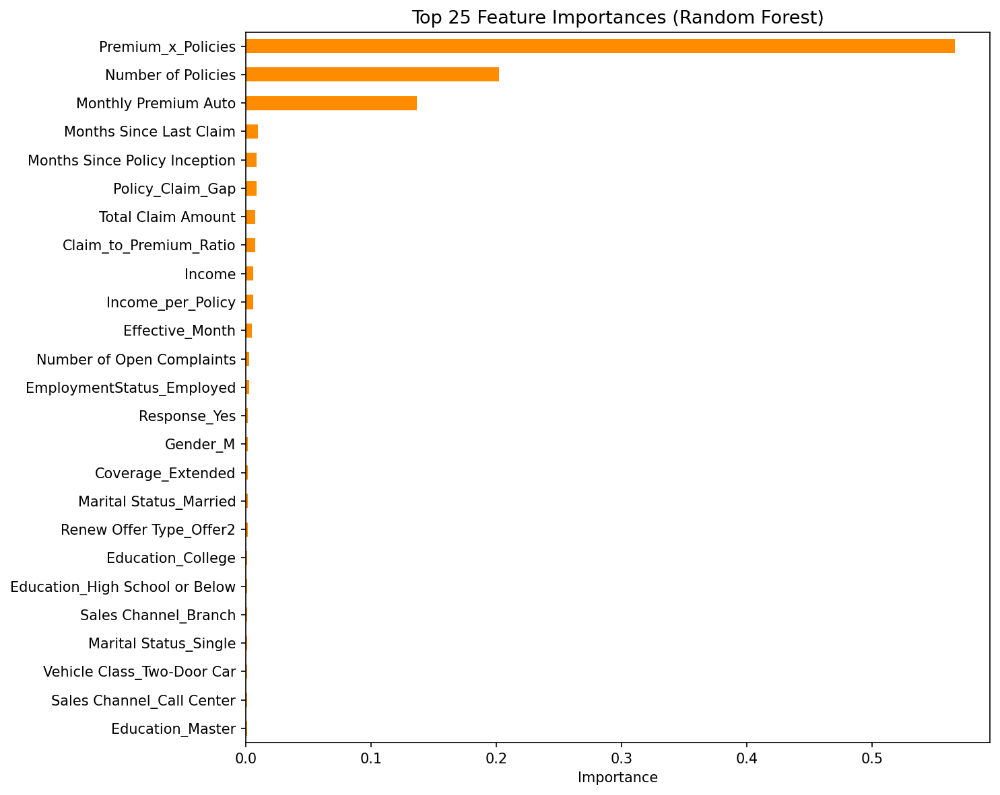

# Customer Lifetime Value Prediction for Auto Insurance Company


**Predict customer lifetime value for auto insurance customers using regression models — enabling targeted retention and premium optimization strategies.**

---

## Table of Contents
1. [Problem Statement](#problem-statement)
2. [Dataset](#dataset)
3. [Project Structure](#project-structure)
4. [Workflow](#workflow)
5. [EDA Highlights](#eda-highlights)
6. [Feature Engineering](#feature-engineering)
7. [Feature Selection](#feature-selection)
8. [Model Results](#model-results)
9. [Business Insights](#business-insights)
10. [Setup & Usage](#setup--usage)
11. [Tech Stack](#tech-stack)

---

## Problem Statement

Customer Lifetime Value (CLV) quantifies the total revenue a business can expect from a single customer account. For auto insurance companies, accurately predicting CLV enables:
- Targeted retention campaigns for high-value customers
- Optimized premium pricing per risk segment
- Efficient allocation of marketing spend

This project builds a regression model that predicts CLV from demographic, policy, and claims data.

---

## Dataset

Source: [Vehicle Insurance Customer Data — Kaggle](https://www.kaggle.com/datasets/ranja7/vehicle-insurance-customer-data)

| Feature | Type | Description |
|---|---|---|
| Customer | ID | Unique customer identifier |
| State | Categorical | Customer's state |
| Customer Lifetime Value | Numerical | **Target** — total CLV in dollars |
| Response | Categorical | Response to last marketing campaign |
| Coverage | Categorical | Insurance coverage level |
| Education | Categorical | Education level |
| EmploymentStatus | Categorical | Employment status |
| Gender | Categorical | Customer gender |
| Income | Numerical | Annual income |
| Location Code | Categorical | Urban/Suburban/Rural |
| Marital Status | Categorical | Marital status |
| Monthly Premium Auto | Numerical | Monthly auto premium paid |
| Months Since Last Claim | Numerical | Recency of last claim |
| Months Since Policy Inception | Numerical | Policy age in months |
| Number of Open Complaints | Numerical | Complaint count |
| Number of Policies | Numerical | Number of active policies |
| Policy Type | Categorical | Type of policy |
| Policy | Categorical | Policy sub-type |
| Renew Offer Type | Categorical | Renewal offer presented |
| Sales Channel | Categorical | How policy was sold |
| Total Claim Amount | Numerical | Total historical claims |
| Vehicle Class | Categorical | Vehicle class |
| Vehicle Size | Categorical | Vehicle size |

---

## Project Structure

```
Customer-Lifetime-Value-Prediction-For-AutoInsurance-Company/
├── data/
│   ├── raw/               # Original CSV (gitignored)
│   └── processed/         # Cleaned data (gitignored)
├── notebooks/             # Jupyter notebooks, one per phase
├── src/
│   ├── config.py          # All paths, constants, hyperparameters
│   ├── data_loader.py     # Load and validate raw data
│   ├── preprocessing.py   # Clean, encode, engineer features
│   ├── model.py           # Train, evaluate, tune, save models
│   └── visualize.py       # All plot functions -> images/
├── models/                # Saved .pkl model files (gitignored)
├── images/                # All plots -- committed for README display
├── reports/               # Results CSVs and PDF report
├── scripts/
│   ├── download_data.py   # Kaggle API download
│   └── generate_pdf.py    # Generate process report PDF
├── .gitignore
├── requirements.txt
├── README.md
└── main.py                # Full pipeline runner
```

---

## Workflow

```
Raw Data
   |
   v
01_Data_Preparation.ipynb  -- EDA, distributions, correlations
   |
   v
02_Feature_Engineering.ipynb  -- Imputation, encoding, new features, scaling
   |
   v
03_Feature_Selection.ipynb  -- LASSO + RFE consensus feature set
   |
   v
04_Model_Training.ipynb  -- 11 models, log-transformed target, CV evaluation
   |
   v
05_Model_Evaluation.ipynb  -- Best model tuning, SHAP, residuals
   |
   v
main.py  -- End-to-end pipeline runner
   |
   v
reports/  -- model_results.csv + PDF process report
```

---

## EDA Highlights

*(Plots added after pipeline run)*





---

## Feature Engineering

| Feature | Formula | Rationale |
|---|---|---|
| CLV_log | log1p(CLV) | Normalize right-skewed target for better model fit |
| Premium_x_Policies | Monthly Premium x Num Policies | Total premium commitment signal |
| Policy_Claim_Gap | Months Since Inception - Months Since Claim | Loyalty vs. recency of claim |
| Claim_to_Premium_Ratio | Total Claims / (Monthly Premium + 1) | Claims efficiency per premium dollar |

---

## Feature Selection

*(Results added after 03_Feature_Selection.ipynb)*

Methods: LASSO (LassoCV) + RFE (GradientBoostingRegressor) — consensus feature set.

---

## Model Results

*(Updated after pipeline run)*

| Model | R2 | RMSE | MAE | CV R2 |
|---|---|---|---|---|
| Random Forest | - | - | - | - |
| XGBoost | - | - | - | - |
| Gradient Boosting | - | - | - | - |
| Extra Trees | - | - | - | - |
| Ridge | - | - | - | - |





---

## Business Insights

*(Added after final model evaluation)*

---

## Setup & Usage

```bash
# 1. Clone the repo
git clone https://github.com/bhavesh2418/Customer-Lifetime-Value-Prediction-For-AutoInsurance-Company.git
cd Customer-Lifetime-Value-Prediction-For-AutoInsurance-Company

# 2. Install dependencies
pip install -r requirements.txt

# 3. Download dataset (requires KAGGLE_USERNAME + KAGGLE_KEY in .env)
python scripts/download_data.py

# 4. Run full pipeline
python main.py

# 5. Launch notebooks
jupyter notebook notebooks/
```

---

## Tech Stack

| Tool | Purpose |
|---|---|
| Python 3.9+ | Core language |
| pandas / numpy | Data manipulation |
| scikit-learn | ML models, preprocessing, evaluation |
| XGBoost | Gradient boosting |
| SHAP | Model explainability |
| matplotlib / seaborn | Visualization |
| ydata-profiling | Automated EDA report |
| fpdf2 | PDF process report generation |
| kaggle | Dataset download |
| joblib | Model serialization |
